Cybersecurity Assessment Lab
A hands-on cybersecurity assessment and digital forensics lab performed against an intentionally vulnerable Metasploitable 2 virtual machine in an isolated VMware environment.
The project covers the full assessment workflow from reconnaissance → web assessment → vulnerability management → packet analysis → digital forensics → reporting.
> **Authorization & Scope:** All testing was performed against the user's own Metasploitable 2 lab host at `192.168.216.132`. No public or third-party systems were tested.
🔎 Lab Environment
Component	Role	Address / Notes
Kali Linux	Assessment and analysis workstation	`192.168.216.131`
Metasploitable 2	Intentionally vulnerable target	`192.168.216.132`
VMware	Isolated virtualization lab	Private `192.168.216.0/24` network
🧭 Assessment Workflow
```text
Lab setup
   ↓
Nmap reconnaissance
   ↓
HTTP enumeration & header analysis
   ↓
OWASP ZAP web assessment
   ↓
Greenbone/OpenVAS vulnerability assessment
   ↓
Wireshark packet analysis
   ↓
Autopsy digital forensics
   ↓
Findings, risk interpretation & remediation
```
---
1. 🔍 Nmap Reconnaissance
A service/version scan was performed against the authorized target:
```bash
nmap -sV 192.168.216.132
```
The scan identified 23 open TCP services, including FTP, SSH, Telnet, DNS, HTTP, SMB, MySQL, PostgreSQL, VNC, IRC and Tomcat.
Key observations
`80/tcp` — Apache HTTP Server `2.2.8` with PHP `5.2.4`
`1524/tcp` — bindshell service identified by Nmap
`8180/tcp` — Apache Tomcat `5.5`
`3306/tcp` — MySQL `5.0.51a`
`5432/tcp` — PostgreSQL `8.3.x`
Evidence: `evidence/nmap-service-scan.txt`
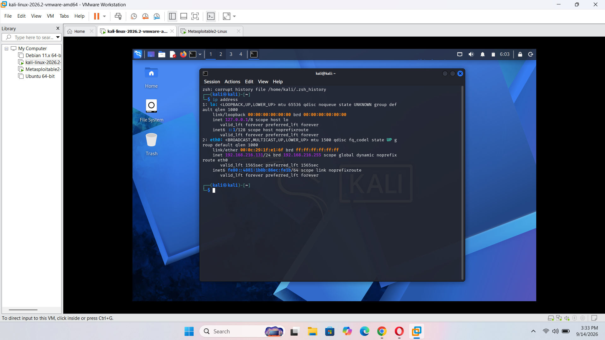
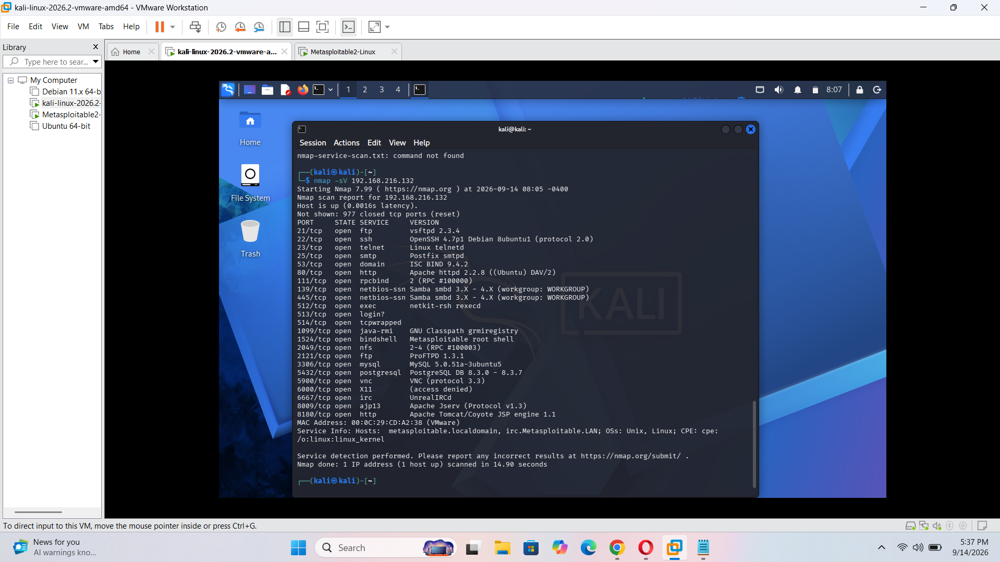
---

2. 🌐 HTTP Enumeration & Header Analysis
Nmap HTTP scripts were used to identify web page titles and response headers:
```bash
nmap -p 80,8180 --script http-title,http-headers 192.168.216.132
```
Additional header checks were performed with:
```bash
curl -I http://192.168.216.132
curl -I http://192.168.216.132:8180
```
The assessment identified technology/version information exposed through HTTP responses, including Apache, PHP and Apache-Coyote/Tomcat details.
Evidence:
`evidence/http-enumeration.txt`
`evidence/http-header-check.txt`
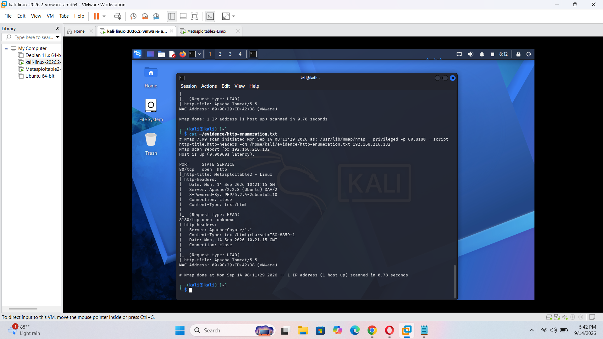
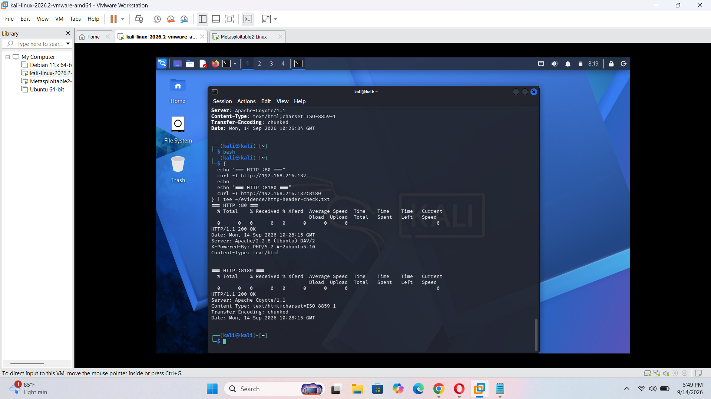
Example observation
The port 80 response exposed server and PHP version information. This is useful during reconnaissance because it helps an assessor understand the technologies exposed by the target.
---

3. 🛡️ OWASP ZAP Web Security Assessment
An automated OWASP ZAP assessment was performed against:
`http://192.168.216.132`
ZAP generated 25 alerts. Three representative findings were selected for deeper analysis. The alerts were not treated as automatically confirmed vulnerabilities; risk and confidence reported by ZAP were retained in the analysis.
Finding 1 — Absence of Anti-CSRF Tokens
Risk: Medium
Confidence: Low
CWE: 352
Observation: ZAP did not identify a recognized anti-CSRF token in the reported HTML form.
Recommendation: Implement robust, validated CSRF protection for state-changing forms.
Finding 2 — Content Security Policy (CSP) Header Not Set
Risk: Medium
Confidence: High
CWE: 693
Observation: ZAP reported that the identified page did not set a `Content-Security-Policy` response header.
Recommendation: Configure the web/server stack to return an appropriate CSP policy.
Finding 3 — Cookie No HttpOnly Flag
Risk: Low
Confidence: Medium
Parameter: `PHPSESSID`
CWE: 1004
Observation: ZAP reported that the `PHPSESSID` cookie was set without the `HttpOnly` attribute.
Recommendation: Set `HttpOnly` on session cookies when client-side JavaScript access is not required.
Evidence: `evidence/zap-findings.md`
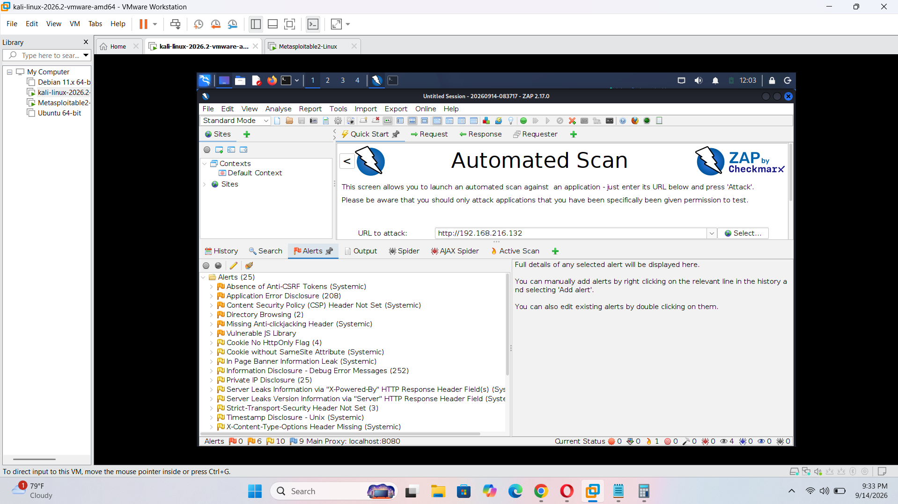
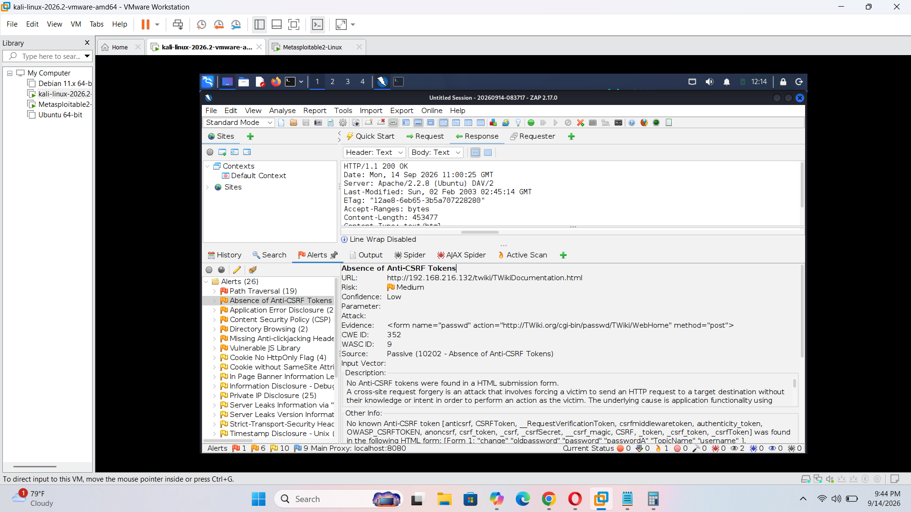
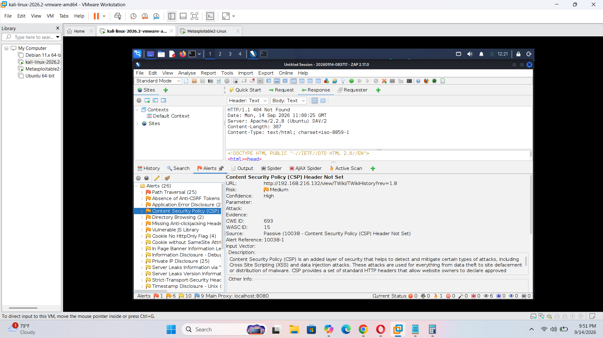
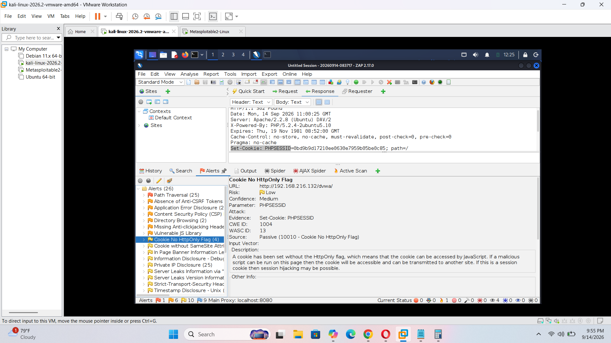
---

4. 🚨 Greenbone/OpenVAS Vulnerability Assessment
A fresh Greenbone/OpenVAS assessment was created specifically for this portfolio project.
Task: `Metasploitable 2 - Full Vulnerability Assessment`
Severity summary
Severity	Count
Critical	13
High	11
Medium	40
Low	6
Log	90
Displayed results	160
Three Critical findings were selected for detailed review.
4.1 Distributed Ruby (dRuby/DRb) Multiple RCE Vulnerabilities
Severity: 10.0 — Critical
QoD: 99%
Location: `8787/tcp`
OID: `1.3.6.1.4.1.25623.1.0.108010`
Assessment: Greenbone detected a potentially dangerous remote command-execution condition associated with the exposed DRb service.
Remediation direction: Restrict or disable unnecessary DRb exposure and apply appropriate security controls and trusted-host access restrictions.
4.2 Possible Backdoor: Ingreslock
Severity: 10.0 — Critical
QoD: 99%
Location: `1524/tcp`
OID: `1.3.6.1.4.1.25623.1.0.103549`
Detection observation: Greenbone's detection test received `uid=0(root) gid=0(root)` from the service.
Remediation: Greenbone recommends a complete cleanup of the affected system.
4.3 TWiki < 4.2.4 Multiple XSS / Command Execution Vulnerabilities
Severity: 10.0 — Critical
QoD: 80%
Location: `80/tcp`
OID: `1.3.6.1.4.1.25623.1.0.800320`
CVEs reported: `CVE-2008-5304`, `CVE-2008-5305`
Assessment: Greenbone reported unsafe input handling that may allow XSS and command/code execution in affected TWiki versions.
Remediation: Upgrade to TWiki 4.2.4 or later, according to the vendor-fix recommendation reported by the scanner.
Evidence: `evidence/openvas-findings.md`
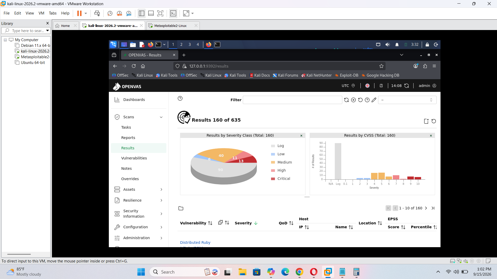
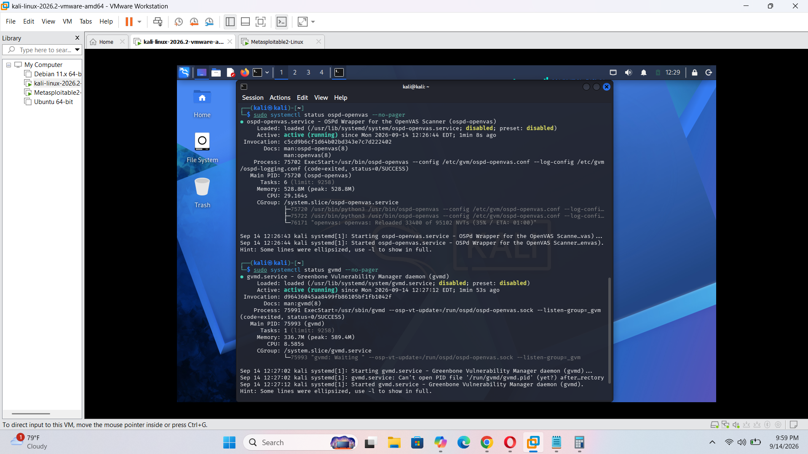
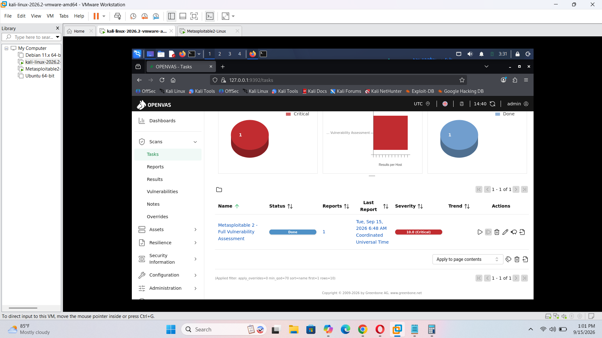
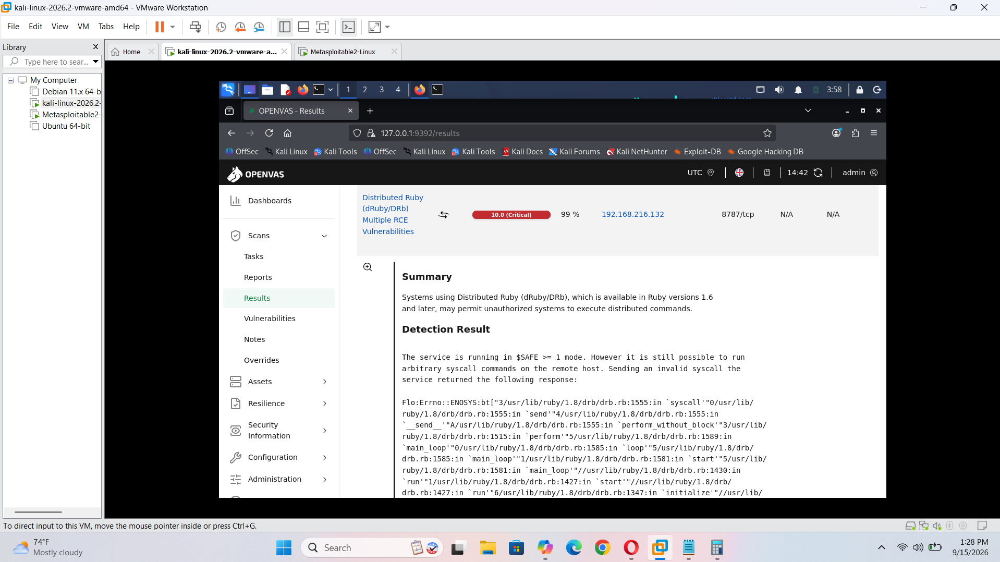
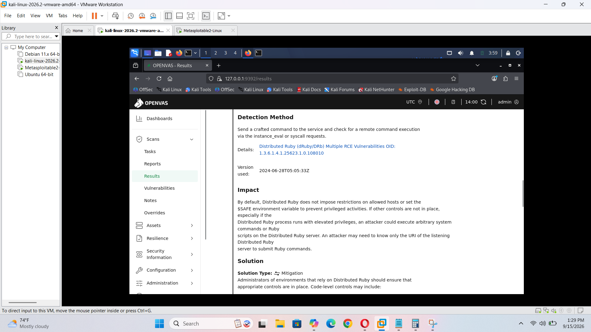
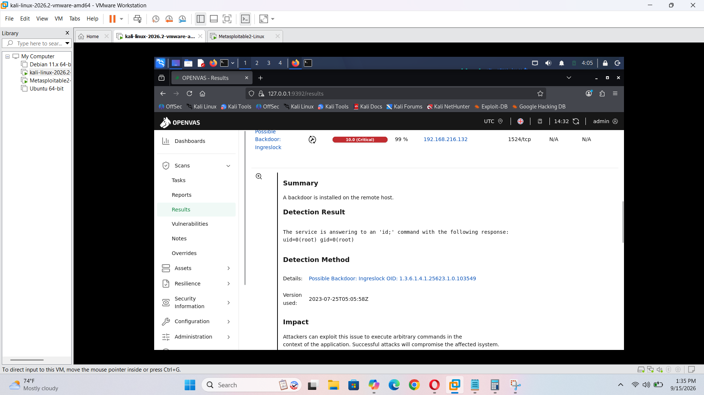

> **Important:** Scanner findings were documented as scanner results. No exploitation of the reported Critical vulnerabilities was required for this project.
---

5. 📡 Wireshark Traffic Analysis
Traffic was captured on Kali while communicating with the Metasploitable 2 VM.
The capture demonstrated:
ARP — local IPv4-to-MAC address resolution
ICMP — echo request/reply traffic
TCP — three-way handshake: `SYN → SYN/ACK → ACK`
HTTP — `GET / HTTP/1.1` followed by `HTTP/1.1 200 OK`
Security observation
The HTTP exchange was directly visible at the application layer because the test service used unencrypted HTTP on TCP port 80. For systems carrying sensitive information, HTTPS/TLS should be used to protect data in transit.
Evidence: `evidence/wireshark-notes.md`
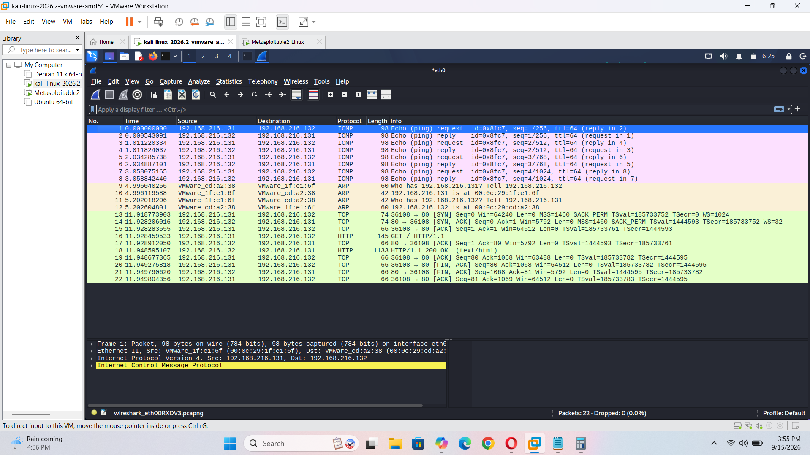
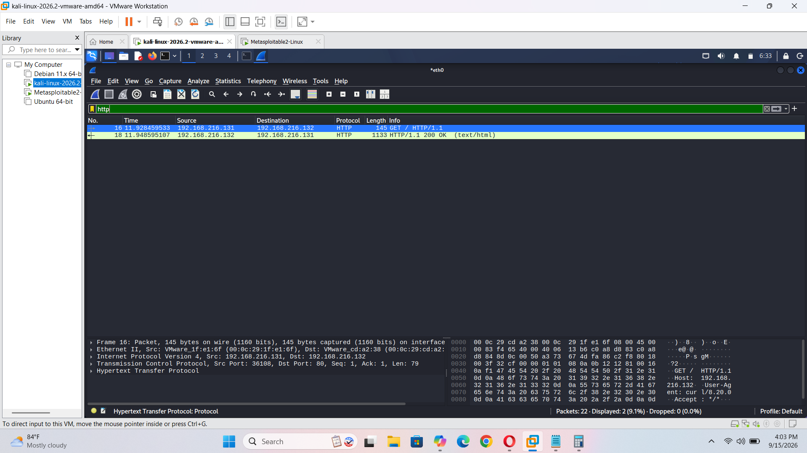
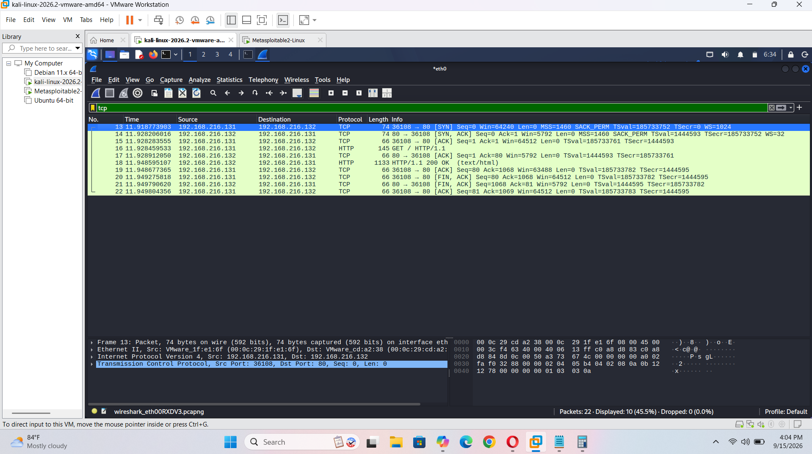
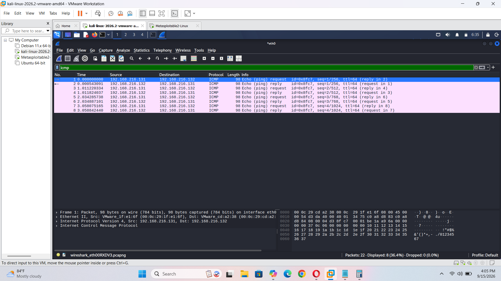
---

6. 🔎 Autopsy Digital Forensics
A fresh Autopsy case was created for the Metasploitable 2 VMDK.
The approximately 1.9 GB VMDK contained:
A Linux `ext` partition (`63` → `481949` sectors)
A Linux LVM partition (`482013` → `16771859` sectors)
Autopsy was used to inspect the `ext` filesystem and its metadata, including:
filesystem directory/file entries
modified, access and change timestamps
UID/GID ownership information
boot-related files
deleted filesystem entries
The deleted-file view identified entries including GRUB backup/temporary files and older kernel-related files. These were treated as forensic artifacts, not automatically as malicious activity.
Evidence: `evidence/autopsy-notes.md`
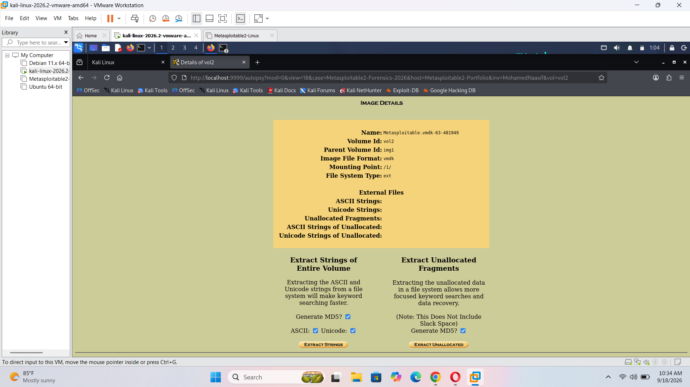
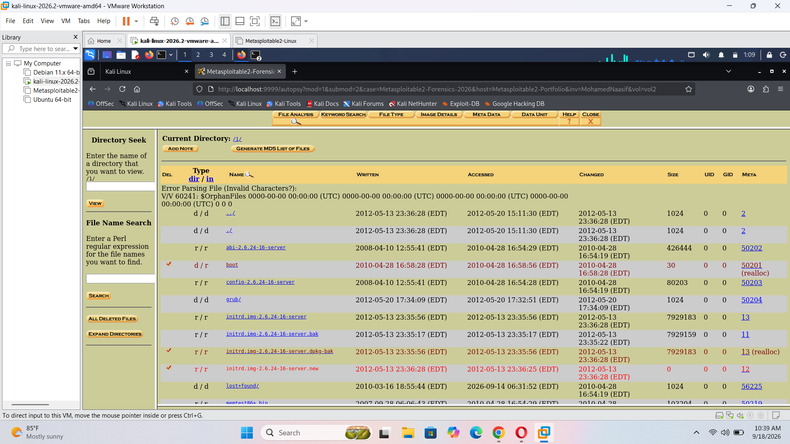
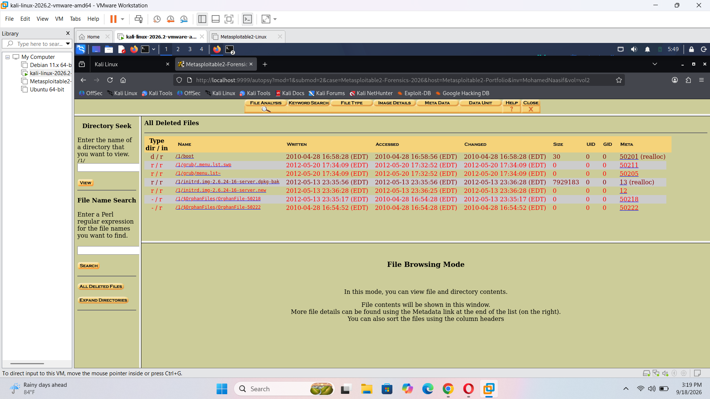
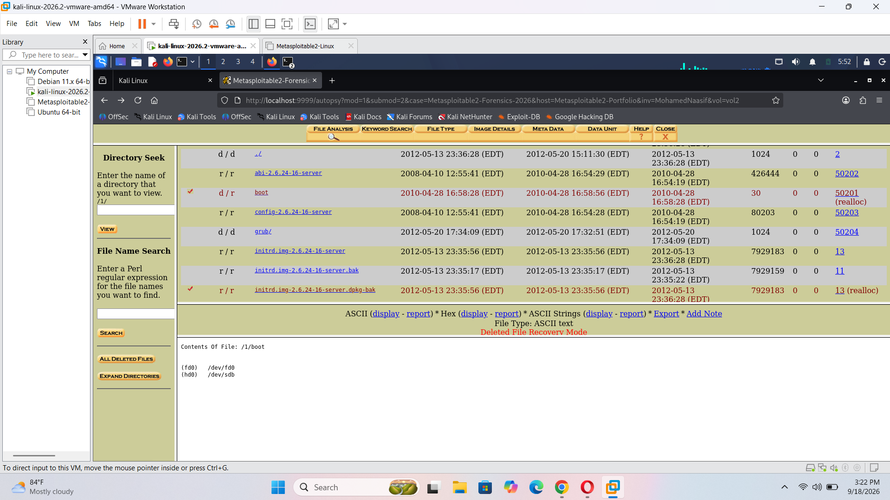
---

🧠 Key Skills Demonstrated
- Network reconnaissance with Nmap
- HTTP enumeration and security-header analysis
- Web application assessment with OWASP ZAP
- Vulnerability assessment with Greenbone/OpenVAS
- Packet analysis with Wireshark
- Linux filesystem and metadata analysis with Autopsy
- Evidence collection and technical documentation
- Risk interpretation and remediation recommendations

📁 Repository Contents
- `report/` — final technical assessment report
- `screenshots/` — visual evidence captured during the lab
- `evidence/` — supporting findings and analysis notes
- `notes/commands.txt` — command reference for revision/interview preparation

📄 Report
[View the Cybersecurity Assessment Lab Report (PDF)](report/your-file-name.pdf)

🎯 Learning Outcome
This project demonstrates a complete beginner-to-intermediate assessment workflow: identify exposed services, examine web technologies, review scanner findings, inspect network traffic, perform basic filesystem forensics, and document evidence with security-focused recommendations.

> [!WARNING]
> **Portfolio Disclaimer**
> This project was performed in an isolated, intentionally vulnerable VMware laboratory environment for educational purposes. The IP addresses and security findings documented here belong to the private lab environment and are not claims about public or third-party systems.
